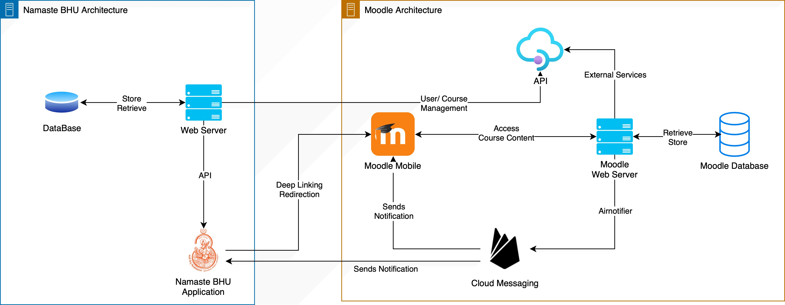

# LMS Integration with Namaste BHU

## Abstract

The integration of a Learning Management System (LMS) with the Namaste BHU application represents a significant advancement in the digital infrastructure of Banaras Hindu University (BHU). This project aims to seamlessly connect Moodle, an open-source LMS, with the Namaste BHU application to create a unified platform for academic management, communication, and engagement. The project encompasses deployment, configuration, and integration phases, involving the setup of Moodle on an Azure instance, updates to the Namaste BHU application, and the development of custom plugins and extensions. Through single sign-on (SSO), deep linking, and notification delivery mechanisms, users can access Moodle content directly from the Namaste BHU application, receive real-time updates and announcements, and collaborate effectively within the academic community. The successful completion of this project signifies a significant milestone in enhancing the academic experience at BHU, promoting accessibility, efficiency, and innovation in teaching and learning practices. Future opportunities for enhancement and expansion include advanced analytics, personalized learning pathways, and integration with external tools and services, ensuring the continued evolution and relevance of the integrated platform in the digital age of education.

_**Keywords**: Learning Management System (LMS), Namaste BHU, Moodle, Single Sign-On (SSO), Deep Linking_

## Proposed Architecture

The proposed architecture for the integration of Moodle with the Namaste BHU application is illustrated in the following diagram:



Read more about the proposed architecture in the [paper](docs/METHODOLOGY.md#proposed-architecture).

## Demo

### Login Demo

Demonstration of the login process using Single Sign-On (SSO) between the Namaste BHU application and Moodle:

https://github.com/PradyumnaKrishna/lms-integration/assets/51270439/cc2ecfeb-81c4-41f8-9abf-8ef8a11c619a

Source: [demo/moodle_login.mp4](demo/moodle_login.mp4)

### Moodle Access

Demonstration of accessing Moodle content by redirecting from the Namaste BHU application to Moodle app using deep linking:

https://github.com/PradyumnaKrishna/lms-integration/assets/51270439/9edc2b38-b08c-460f-b38b-b1145bdeace2

Source: [demo/moodle_access.mp4](demo/moodle_access.mp4)

## Project Report

The detailed report for the project can be found [here](docs) or view complete PDF [here](paper.pdf).

## CITATION

If you find this project useful, please consider citing it as:

```
@software{PyKr2024,
  author = {Krishna, Pradyumna},
  title = {{LMS Integration with Namaste BHU}},
  url = {https://github.com/PradyumnaKrishna/lms-integration},
}
```

## License

This project is licensed under the MIT License - see the [LICENSE](LICENSE.md) file for details.
